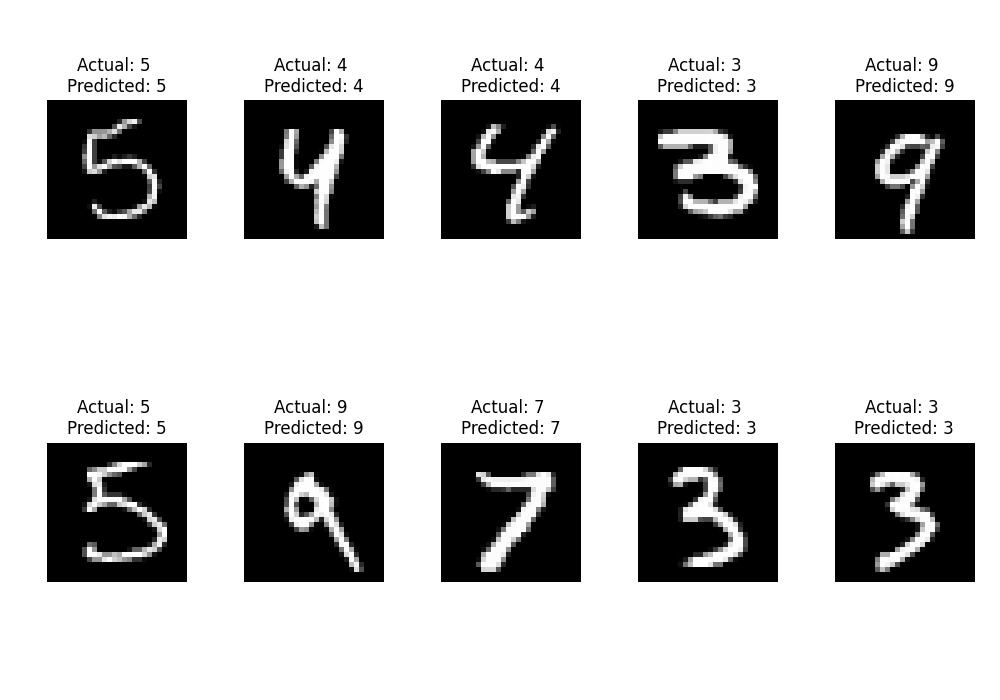

# CNN Image Classification for FashionMNIST and MNIST

This repository contains a PyTorch implementation of a Convolutional Neural Network (CNN) for image classification for the FashionMNIST and MNIST datasets. The project is structured to be modular and flexible, allowing for easy extension to other datasets and models.

## Project Structure

<ul>
    <li>data
        <ul>
            <li>FMNIST_data.py - Data loader for FashionMNIST</li>
            <li>MNIST_data.py - Data loader for MNIST</li>
        </ul>
    </li>
    <li>cnn_m1.py - CNN model definition</li>
    <li>utils.py - Utility functions for training and testing</li>
    <li>main.py - Main script for training</li>
    <li>test.py - Script for testing</li>
    <li>requirements.txt - Required Python packages</li>
    <li>README.md - Project documentation</li>
</ul>


## Setup

1. Clone the repository:
    ```bash
    git clone https://github.com/satyapalsinh10/Classification_MNIST-FashionMNIST.git
    cd Classification_MNIST-FashionMNIST
    ```

2. Install the required packages:
    ```bash
    pip install -r requirements.txt
    ```

## Usage

### Training

To train the model on the MNIST dataset:
```bash
python main.py --dataset_name MNIST
```

To train the model on the FashionMNIST dataset:
```bash
python main.py --dataset_name FashionMNIST
```

### Testing

To test the model on the MNIST dataset:
```bash
python test.py --dataset_name MNIST
```

To test the model on the FashionMNIST dataset:
```bash
python test.py --dataset_name FashionMNIST
```


### File Descriptions
- main.py: The main script for training the CNN model. It accepts the dataset name as an argument and trains the model on the specified dataset.
- train.py: Contains the training function that handles the core logic of training the CNN model.
- test.py: The script for testing the trained CNN model. It loads the model weights from the corresponding file and evaluates the model on the test set.
- data/FMNIST_data.py: Contains the data loader for the FashionMNIST dataset.
- data/MNIST_data.py: Contains the data loader for the MNIST dataset.
- cnn_m1.py: Defines the architecture of the CNN model.
- utils.py: Utility functions for training and testing the model.


## Results: 
After training, the model weights are saved in files named `cnn_FashionMNIST.pth` or `cnn_MNIST.pth` depending on the dataset used for training. The testing script loads these weights and evaluates the model on the test set, printing the test loss and accuracy.

### Visualize the outputs

To visualize the results on the MNIST dataset:
```bash
python visualize.py --dataset_name MNIST
```

<p align="center">
  
</p>


To visualize the results on the FashionMNIST dataset:
```bash
python visualize.py --dataset_name FashionMNIST
```
<p align="center">
  
</p>


